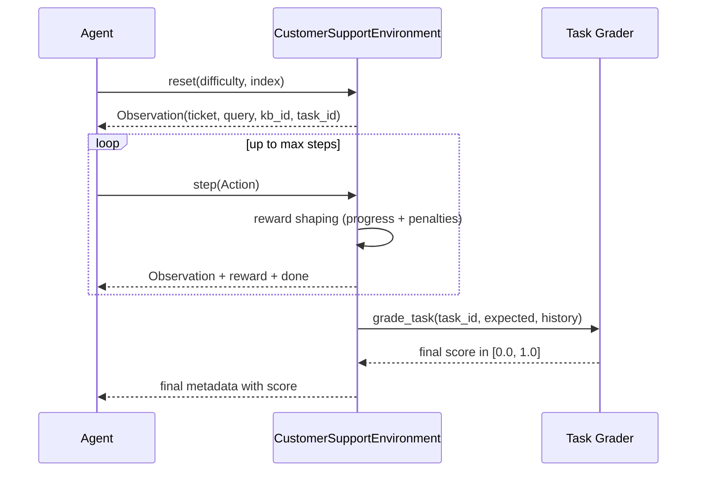

# Customer Support OpenEnv Benchmark Diagram

```mermaid
flowchart TD
    A[dataset.csv] --> B[data_loader.py\nload + normalize + split]
    B --> C[kb.py\nbuild knowledge base]
    B --> D[server/customer_support_environment.py\nOpenEnv Environment]
    C --> D
    E[tasks.py\n3 tasks + deterministic graders] --> D
    F[models.py\nTyped Action / Observation / State] --> D

    D --> G[OpenEnv FastAPI App\nserver/app.py]
    G --> H[POST /reset]
    G --> I[POST /step]
    G --> J[GET /state]
    G --> K[GET /schema]

    L[inference.py\nbaseline agent run] --> G
    L --> M[[Structured Logs\n[START] [STEP] [END]]]
    D --> N[[Reward Shaping\npartial progress + penalties]]
    D --> O[[Episode Final Score\n0.0 to 1.0]]

    P[openenv.yaml] --> G
    Q[Dockerfile] --> R[HF Space Deployment]
    G --> R
```

## Episode Logic (high-level)


